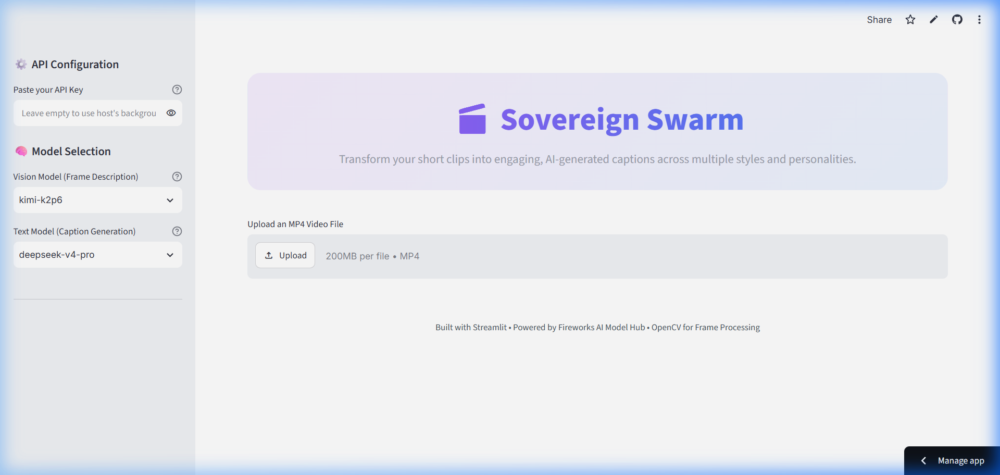

# Sovereign Swarm - Multi-Tone Video Captioner

A sleek, premium Streamlit application that processes video clips (between 30 seconds and 2 minutes), extracts keyframes, and uses Fireworks AI model endpoints to generate captions in multiple distinct styles (Formal, Sarcastic, Humorous Tech, and Everyday Humor).

[](https://sovereign-swarm.streamlit.app/)

## 📸 App Interface



## 📹 Video Demonstration

Check out the [Sovereign Swarm Video Demonstration](https://www.loom.com/share/1612cd0560dc4de7b960b3255160a443) to see the app in action!


## 🚀 Features

- **High-Quality UI:** Built with custom dark styling, CSS-based cards for frame previews, and modern tabs for exploring different caption tones.
- **Auto Frame Extraction:** Uses OpenCV to extract exactly three evenly spaced frames (at 25%, 50%, and 75% progression) from the video.
- **Dynamic Model Selection:** Choose from the latest frontier models including Google **Gemma 4 31B IT**, **Gemma 4 26B A4B IT**, Llama 3.3, Qwen 2.5 VL, or input any custom model ID.
- **Secure API Configuration:** Uses your default API key if configured, but lets other users override it with their own key in the sidebar if credits run out.

---

## 🛠️ Installation & Local Usage

Ensure you have Python 3.8+ installed.

1. **Clone the Repository:**
   ```bash
   git clone https://github.com/harsh-18/sovereign-swarm.git
   cd sovereign-swarm
   ```

2. **Install Dependencies:**
   ```bash
   pip install streamlit opencv-python openai
   ```

3. **Run Streamlit Locally:**
   ```bash
   streamlit run app.py
   ```

---

## ☁️ Deployment (Streamlit Community Cloud)

You can easily deploy this app for free on [Streamlit Community Cloud](https://share.streamlit.io):

1. Go to [share.streamlit.io](https://share.streamlit.io) and log in with your GitHub account.
2. Click **New app**.
3. Select your repository `sovereign-swarm`, branch `main`, and main file path `app.py`.
4. Click **Advanced settings...** to add your secrets.
5. In the **Secrets** text area, paste your default Fireworks API key:
   ```toml
   FIREWORKS_API_KEY = "your_fireworks_api_key_here"
   ```
6. Click **Save** and then **Deploy!**

This allows the app to be powered by your API key by default. If your credits run out, users can simply paste their own keys in the sidebar input box to continue using it.

## 📊 Presentation

A widescreen slide deck summarizing the vision, system architecture, key features, and deployment steps of the project is available:
- Download the PowerPoint deck: [Sovereign_Swarm_v2.pptx](Sovereign_Swarm.pptx)

---

## 📄 License

This project is licensed under the Apache License 2.0. See the [LICENSE](LICENSE) file for details.
